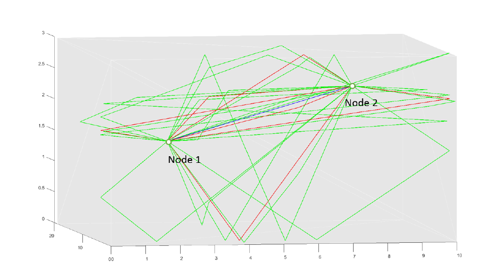

# Q-D realization software
> A MATLAB open-source ray-tracer specialized for mmWave RF applications.

## Table of Contents
* [Installation](#installation)
  * [Requirements](#requirements)
* [How to Run](#how-to-run)
  * [Documentation](#documentation)
* [Features](#features)
* [Contributing](#contributing)
* [Authors](#authors)
* [License](#license)

## Installation
The software does not require any installation procedure: simply download or clone the repository to your local folders.

### Requirements
The codebase is written in MATLAB. It is currently being tested on MATLAB R2019b, but it should be backward-compatible down to MATLAB R2016b.

Only basic toolboxes should be needed to run the code. If this is not the case, please let the authors know.

## How to Run
* `cd` to the `src` folder
* Create a folder with the desired name for your scenario, e.g., `ScenarioTest`
  * Creating a scenario in a subfolder is also allowed
* Inside you scenario folder, create the `Input` folder
  * Note: case sensitive
  * Here all the input/configuration files should be placed. More information about the files needed and their format can be found in the documentation
* Populate the `Input` folder
  * If you are a new user, you could copy/paste the input folder of one of the `examples/` scenarios. Please do not overwrite these scenarios as they are used for testing
* Open the `main.m` script and edit the variable `scenarioNameStr` with your scenario folder relative path, e.g., `scenarioNameStr = 'ScenarioTest';`
* Run the `main.m` script
* Results can be found in the `Output` folder of the target scenario

### Documentation
More details about the software can be found in the documentation ([docs/Documentation.pdf](docs/Documentation.pdf)).

## Features
1. Open-source
1. Ray-tracing based on the method of images
1. Specifically tailored for mmWave propagation, thus only considering specular reflection and ignoring diffraction
1. Quasi-Deterministic ray diffusion model based on real-world measurements is included
1. Material libraries for ray diffusion are also included
1. Trace-based mobility is supported
1. Accepts CAD files in XML and AMF formats

## Contributing
Feedbacks and additions are more than welcomed! You can directly contact the [authors](#Authors) for any information.

For more information check out the [CONTRIBUTING](CONTRIBUTING) file.

## Authors

The Q-D Realization software has been developed by [Anuraag Bodi](https://www.nist.gov/people/anuraag-bodi) and maintained by [Tanguy Ropitault](https://www.nist.gov/people/tanguy-ropitault).

The current version of the code has been developed in collaboration with University of Padova, Department of Information Engineering, [SIGNET lab.](http://signet.dei.unipd.it/), under Prof. [Michele Zorzi](mailto:zorzi@dei.unipd.it)'s supervision.

You can find the detailed list of contributors [here](https://github.com/wigig-tools/qd-realization/graphs/contributors).

## License
Please refer to the [LICENSE](LICENSE) file for more information.
